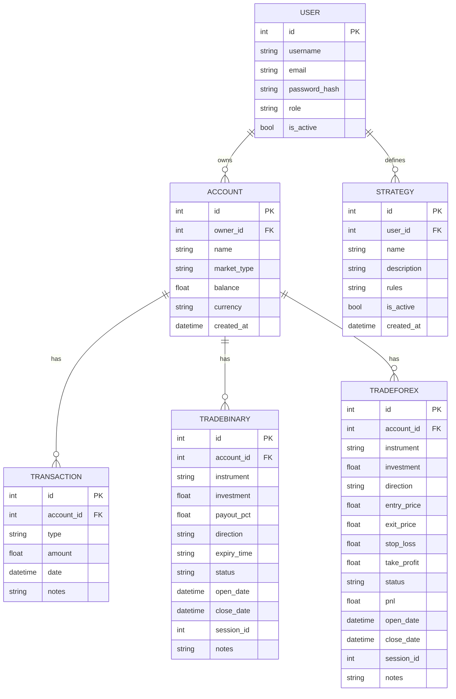

# Jade Capital Pro

Plataforma de trading (frontend Next.js + backend FastAPI) con:
- Autenticacion JWT
- Cuentas (forex/binary)
- Depositos / retiros
- Registro de trades (binarios / forex)
- Jade Bot (analisis y entrenamiento)
- Base de conocimiento (carga de PDFs)

---

## Estructura

- `jade_capital_pro/frontend/`: Next.js (App Router) + Tailwind
- `jade_capital_pro/backend/`: FastAPI + SQLModel (SQLite)
- `jade_capital_pro/deploy.sh`: script de despliegue local (puertos 8080/3000)

---

## Puertos y URLs

- Backend API: `http://localhost:8080`
- Prefijo API: `http://localhost:8080/api/v1`
- Frontend: `http://localhost:3000`

Si `localhost` resuelve a IPv6 y da problemas, usa `http://127.0.0.1:8080`.

Nota: el frontend usa `baseURL = http://<host>:8080/api/v1` (ver `jade_capital_pro/frontend/src/lib/api.ts`).

---

## Comandos (dev / build / lint / tests)

### Backend (FastAPI)

Prerequisitos (Ubuntu/Debian):

```bash
sudo apt update
sudo apt install -y python3-pip python3-venv
```

Instalar deps:

```bash
cd jade_capital_pro/backend
python3 -m venv .venv
source .venv/bin/activate
pip install -r requirements.txt
pip install -r requirements-dev.txt
```

Si `python3 -m venv` falla por `ensurepip` (entornos sin `python3-venv`):

```bash
cd jade_capital_pro/backend
python3 -m venv --without-pip .venv
curl -sSLo /tmp/get-pip.py https://bootstrap.pypa.io/get-pip.py
./.venv/bin/python /tmp/get-pip.py
./.venv/bin/pip install -r requirements.txt -r requirements-dev.txt
```

Levantar API (dev):

```bash
cd jade_capital_pro/backend
source .venv/bin/activate
uvicorn app.main:app --host 0.0.0.0 --port 8080 --reload
```

Tests:

```bash
cd jade_capital_pro/backend
source .venv/bin/activate
python -m pytest
```

Un solo test:

```bash
cd jade_capital_pro/backend
source .venv/bin/activate
python -m pytest tests/test_auth_and_accounts.py::test_login_and_create_account
```

### Frontend (Next.js)

Instalar deps:

```bash
cd jade_capital_pro/frontend
npm ci
```

Dev:

```bash
cd jade_capital_pro/frontend
npm run dev
```

Lint:

```bash
cd jade_capital_pro/frontend
npm run lint
```

Build:

```bash
cd jade_capital_pro/frontend
npm run build
```

---

## Variables de entorno

Frontend:
- `NEXT_PUBLIC_API_URL` (opcional): si no existe, usa `http://<host>:8080/api/v1`
- Ejemplo: `jade_capital_pro/frontend/.env.production`

Backend:
- DB: actualmente hardcodeado a SQLite (ver abajo)
- JWT: `SECRET_KEY` esta hardcodeada en `jade_capital_pro/backend/app/core/security.py` (mover a .env en produccion)

---

## Base de datos (host/user/password/db)

Actualmente NO se usa Postgres/MySQL. Se usa SQLite:

- Archivo: `jade_capital_pro/backend/jade_pro.db`
- URL: `sqlite:///./jade_pro.db` (ver `jade_capital_pro/backend/app/db/db.py`)
- Host/user/password: no aplican (SQLite es un archivo local)

Si quieres usar Postgres, hay que cambiar `jade_capital_pro/backend/app/db/db.py` para leer `DATABASE_URL` desde entorno.

---

## Diagrama Entidad-Relacion (ER)



---

## API (resumen)

Base: `http://localhost:8080/api/v1`

Auth:
- `POST /auth/register`
- `POST /auth/token`

Trading:
- `POST /trading/accounts?name=...&market_type=forex|binary` (requiere Bearer)
- `GET /trading/accounts` (requiere Bearer)
- `POST /trading/accounts/{id}/deposit?amount=...&notes=...` (requiere Bearer)
- `POST /trading/accounts/{id}/withdraw?amount=...&notes=...` (requiere Bearer)
- `POST /trading/trades/manual` (multipart/form-data; crea operacion binaria/forex segun `account_id`; soporta `before_image` y `after_image`)
- `GET /trading/transactions/{account_id}` (requiere Bearer)
- `GET /trading/trades/{account_id}` (requiere Bearer)
- `GET/POST/DELETE /trading/strategies` (requiere Bearer)

Knowledge base:
- `POST /knowledge/upload` (multipart/form-data, campo `file`) acepta `.pdf`/`.PDF`
- `GET /knowledge/list`
- `GET /knowledge/search?query=...`

Bot:
- `POST /bot/analyze?instrument=...` (body opcional: lista de velas)
- `POST /bot/train`
- `GET /bot/prediction?instrument=...&session_id=...&investment=...`

---

## Guia de usuario (flujo basico)

1) Login
- Ir a `/login`
- Se guarda cookie `token` (JWT)

2) Crear cuenta
- Ir a `Dashboard > Balance`
- Boton "Nueva Cuenta" -> nombre + mercado

3) Depositar / retirar
- En `Balance`, seleccionar cuenta
- Accion rapida: Depositar / Retirar

4) Libreria (PDF)
- Ir a `Dashboard > Libreria`
- Subir un PDF (`.pdf`)

5) Jade Bot
- Ir a `Dashboard > Jade Bot`
- "Entrenar IA" requiere historial suficiente
- "Analizar Ahora" puede retornar "No se encontraron patrones"

---

## Manejo de errores (frontend)

- No se usan `alert()`.
- Cualquier error de API se muestra como toast en pagina (ver `jade_capital_pro/frontend/src/components/ToastStack.tsx`).

---

## Convenciones de codigo

Frontend (TypeScript/React):
- Imports: primero externos, luego alias `@/`, luego relativos.
- Evitar `alert()`; usar toasts (`useToastStore`).
- Errores de API: usar `getApiErrorMessage()`.
- Mantener rutas de API SIN prefijo `/api/v1` (el prefijo ya esta en `baseURL`).

Backend (Python/FastAPI):
- Endpoints deben devolver `HTTPException(..., detail=...)` para errores.
- Validar auth con `Depends(get_current_user)`.
- Evitar escribir paths inseguros: usar `os.path.basename()` para archivos.

---

## Imagenes de operaciones

- Las capturas (antes/despues) se guardan en `jade_capital_pro/backend/docs/trade_uploads/`.
- Se exponen como estaticos en backend:
  - `GET http://127.0.0.1:8080/media/trades/<filename>`
